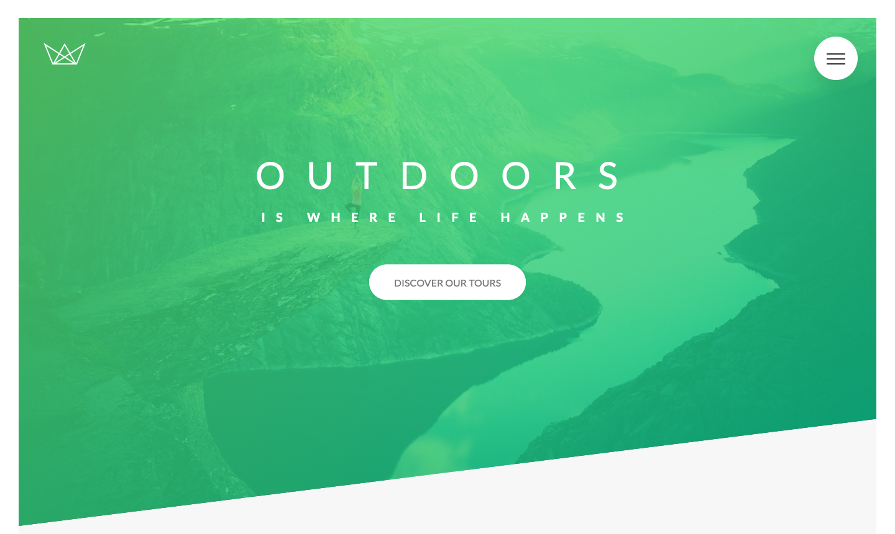
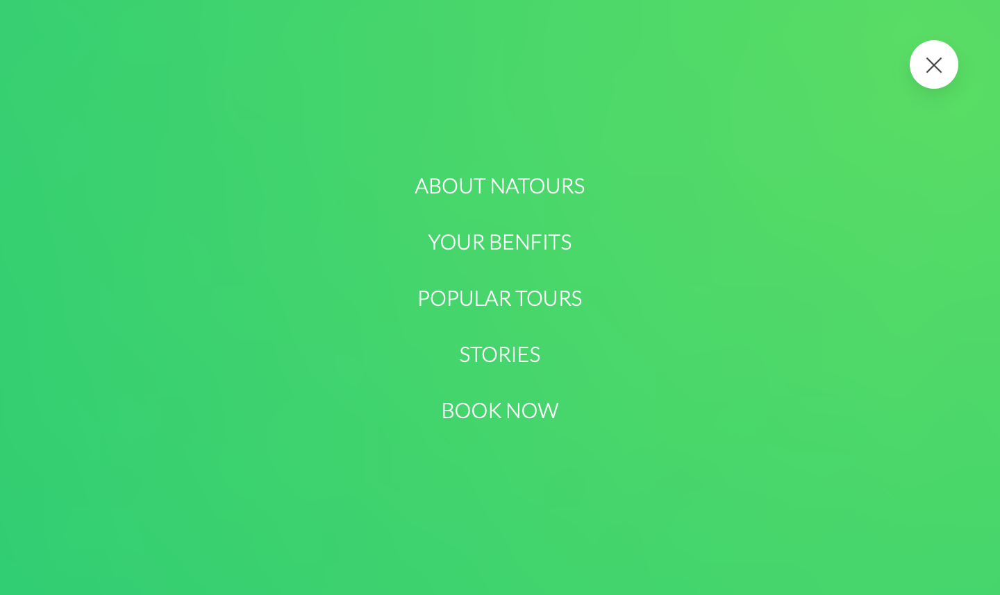
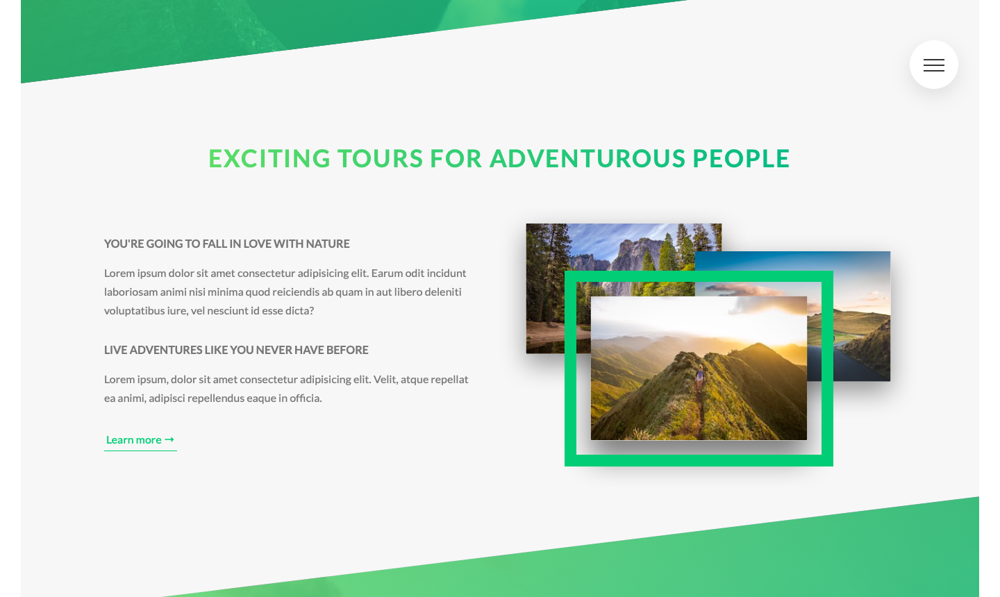
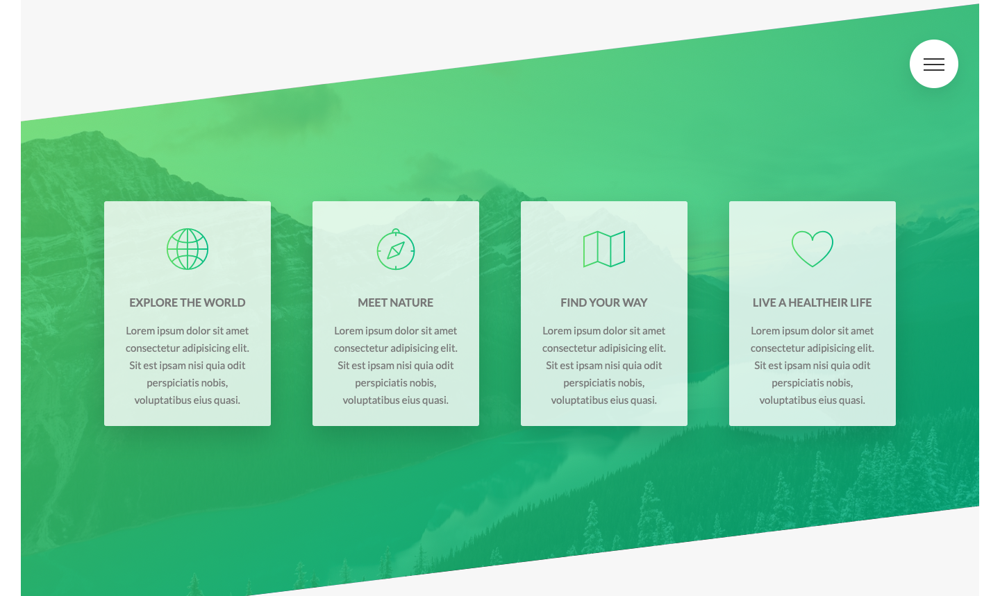
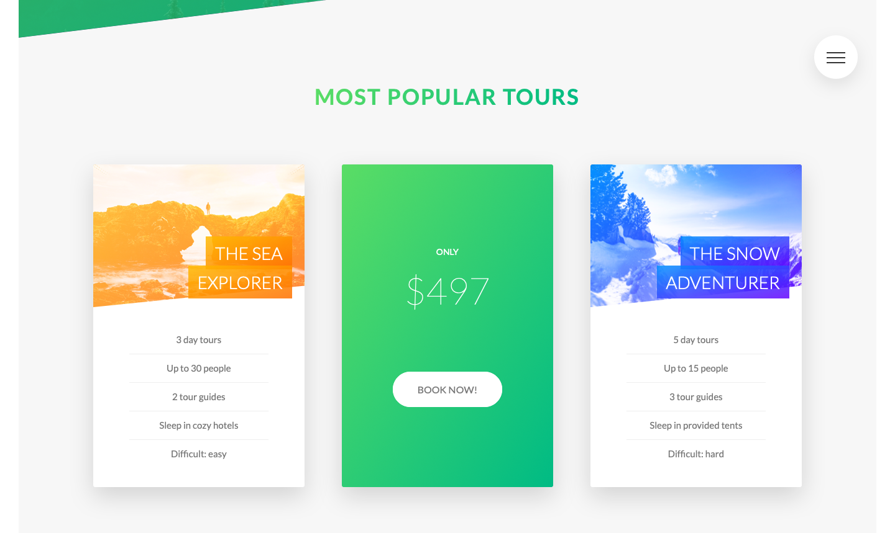
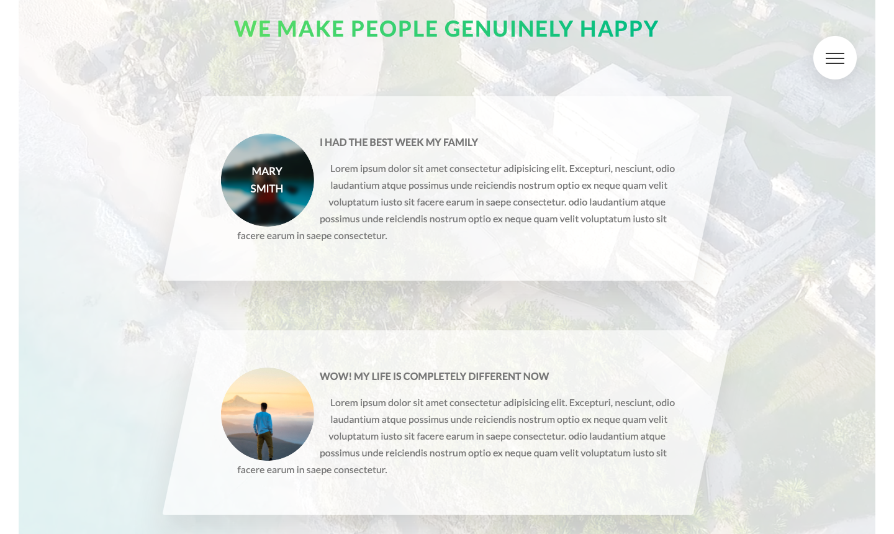
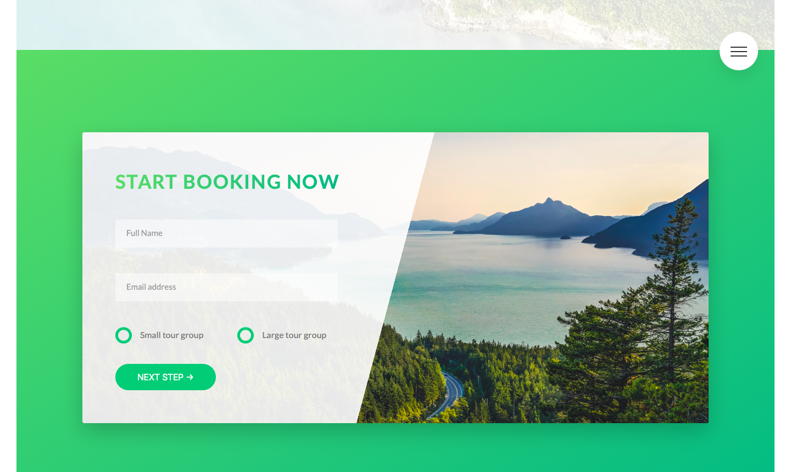
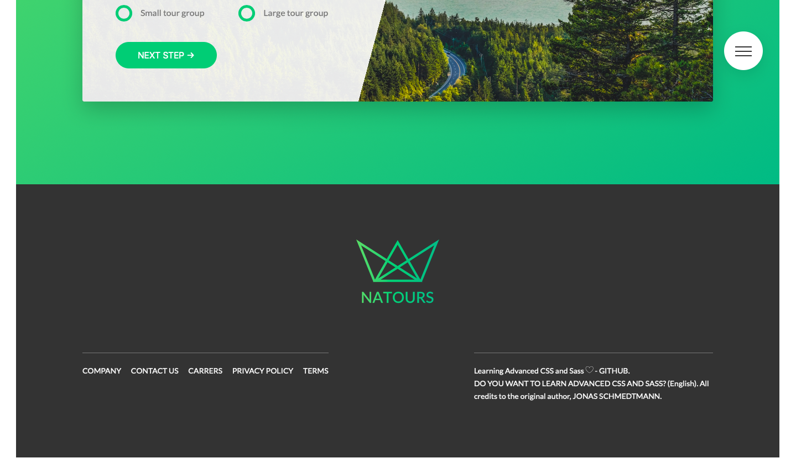
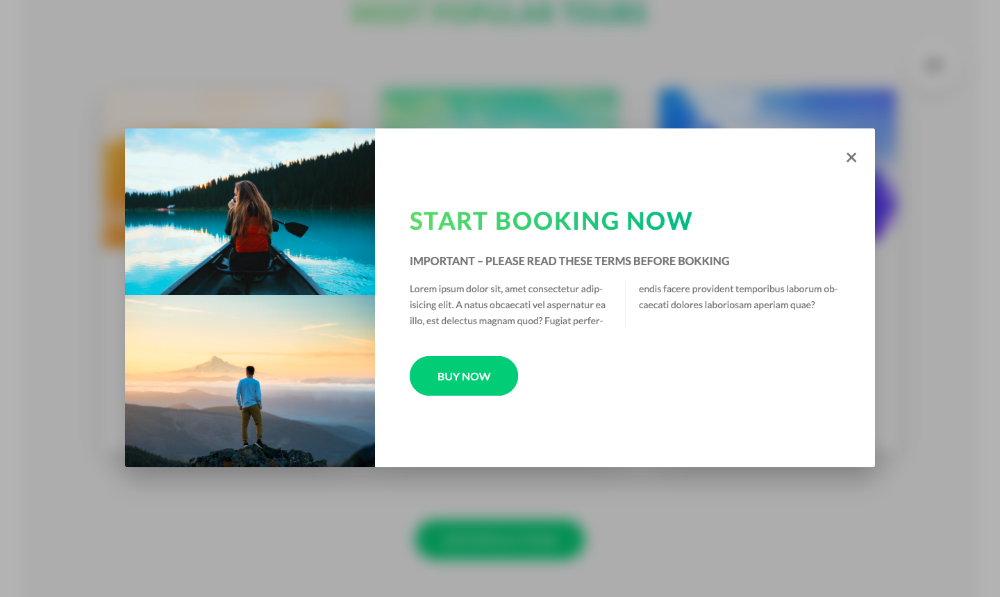

# ADVANCED CSS AND SASS - NATOURS PROJECT

## NATOURS
Please read instruction (just to work in development environment)

    > Install Docker First

    > Then run docker sh docker-start.sh   

    >It will setup whole required architecture includes 

        > 1 App Frontend Container which has
            - nodejs server + source code
	  

## Pull Image Node Js  with following command
    sh docker-pull-node.sh

## Build and Start Containers Images with following command
    sh docker-start.sh

## TO complie for productionn
    sh docker-build.sh

## The service running on following port

- 1] frontend app service runs on 8080 external port

> [Do you want to learn Advanced CSS and Sass?]</a> (English). **All credits to the original author, [Jonas Schmedtmann]**

[Do you want to learn Advanced CSS and Sass?]: <https://www.udemy.com/course/advanced-css-and-sass>

[Jonas Schmedtmann]: <https://twitter.com/jonasschmedtman>